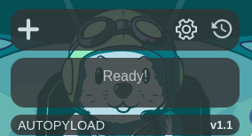

# AutoPyLoad

A lightweight Chrome extension that lets you quickly send the current URL to your PyLoad server.



## Features

- Instantly add the current URL to your PyLoad queue
- View history of added urls.
- Clear history of added urls.
- Configure PyLoad server url and credentials.

## Building

To build the extension, use the provided Makefile:

```bash
make build
```
## Installation 

### Chrome Web Store

Available now on the [Chrome Web Store](https://chromewebstore.google.com/detail/autopyload/ilcjfjpgoaeggpalbjbfiacnedimkodm)

### Manual from Source

1. Clone this repository.
2. Open Chrome and go to chrome://extensions/.
3. Enable "Developer mode".
4. Click 'Load unpacked' and select the project folder.

## How to use

1. Open the AutoPyLoad extension from the Chrome extensions menu.
2. Click the 'cog' icon to set your PyLoad server URL and API key.
3. Click the 'history' icon to view your URL history.
4. Use the 'add' button to queue the current tab’s URL.
5. Optionally, visit your PyLoad dashboard to confirm the URL has been added.

## License

Licensed under the [MIT License](LICENSE).
